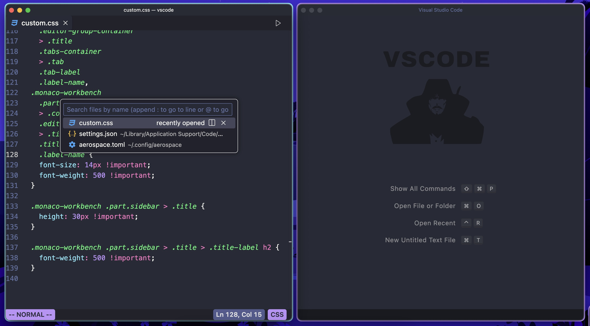
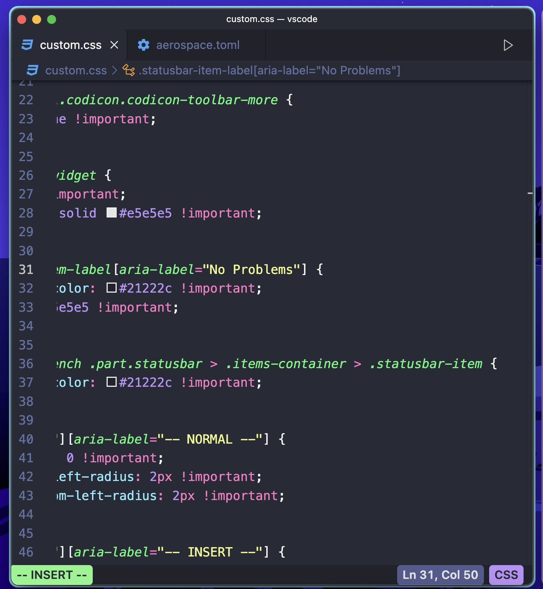
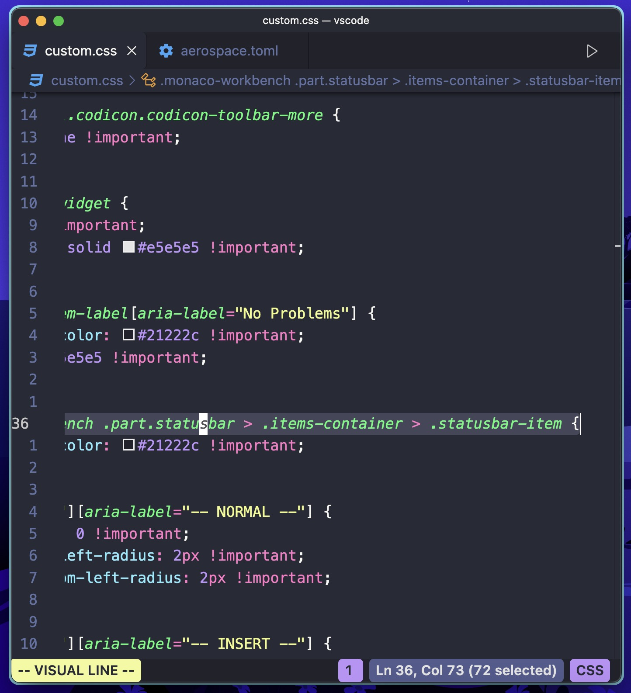
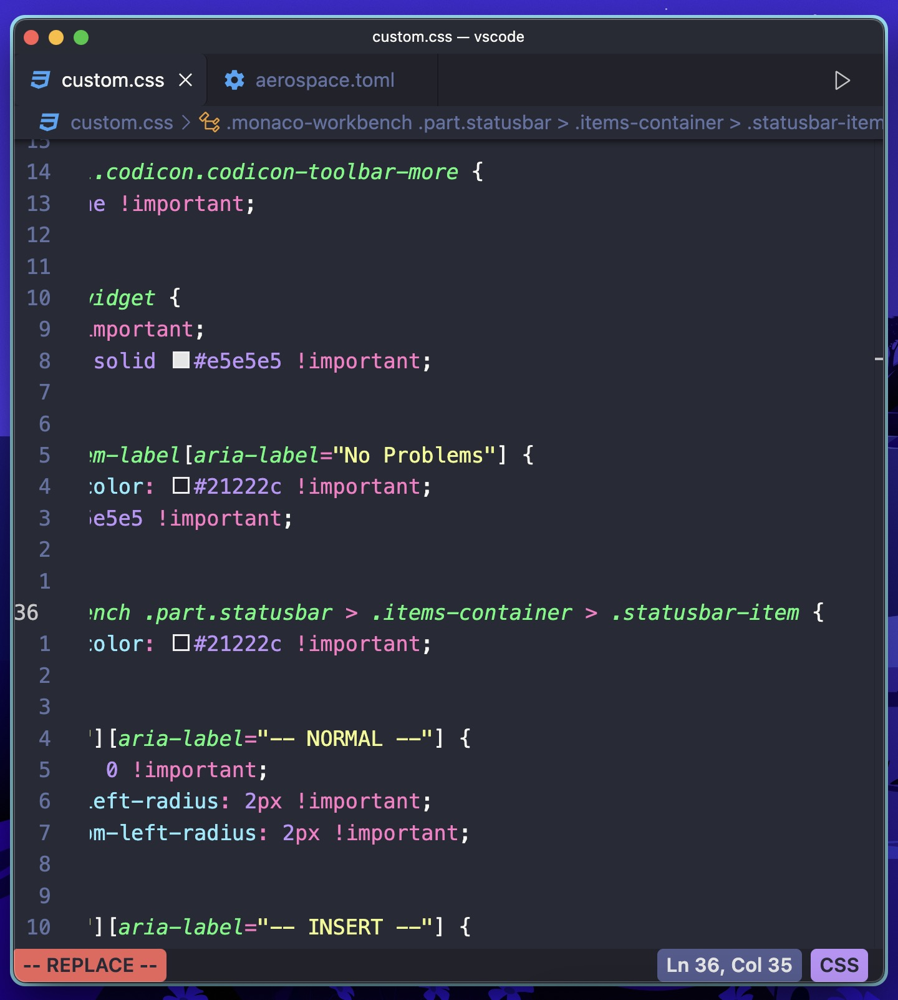
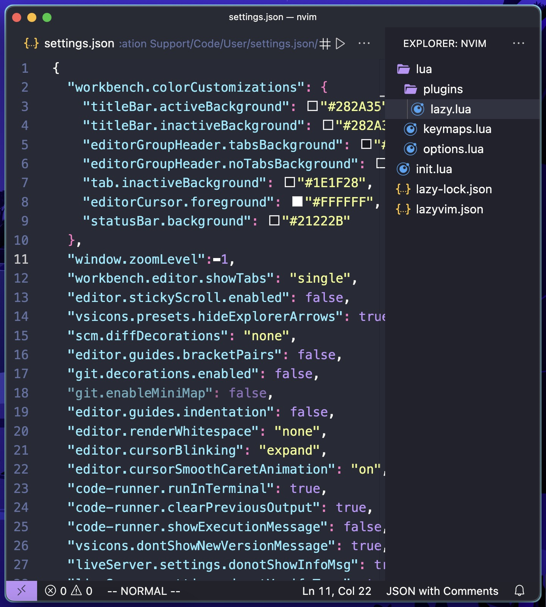

# Vscode Advanced Tweaks

## Installation
To install the new version:
- First, make sure to install the custom css and js loader in vscode. Follow the instructions on the extension to make it work
- Second, copy and paste the contents of `custom-settings.json` into your `settings.json` in vscode. Replace the file path with the path to your custom css file
- Third, download or copy the contents of `custom.css` into the custom css file linked into the path in `settings.json`
- Reload custom css and js loader extension

To use the old version:
- Copy and paste the contents of `settings.json` into your `settings.json` file in vscode

## My new setup using custom css and js extension looks like this:
- Changed command palette
- Changed status bar
- Added dashboard
- Removed highlight from active tab and rounded them a bit. Also removed box shadow under tab bar when scrolling
- Made tab and explorer title bars smaller to allow for more coding space. Also changed font sizes and font weights to make them more clear
- Added colour changes for the vim extension
- Removed a few more extra icons 
  

### Insert mode

### Visual mode

### Replace mode

## My old vscode setup that requires no custom css extension: 

