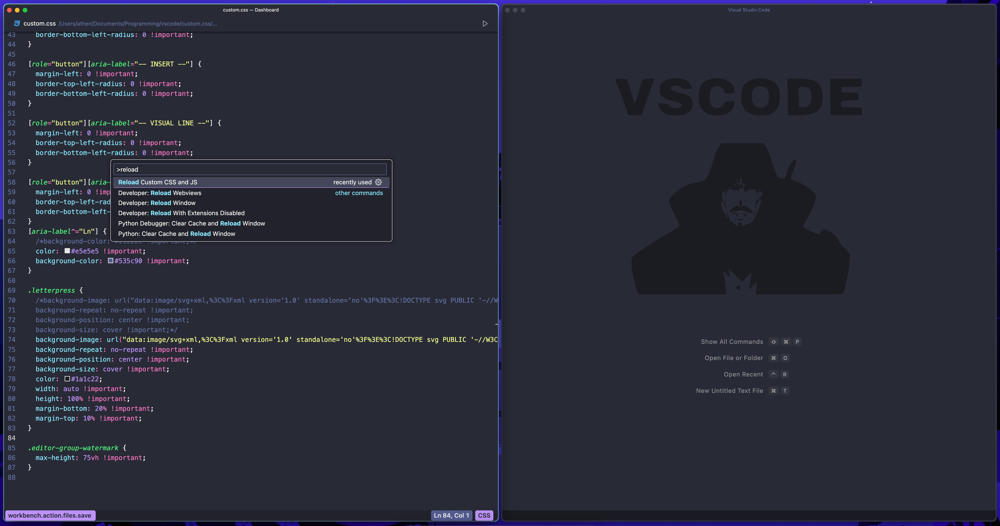

## My new setup using custom css and js extension looks like this:
- Changed command palette
- Changed status bar
- Added dashboard
- Removed a few more extra icons 
  

## My old vscode setup that requires no custom css extension: 

